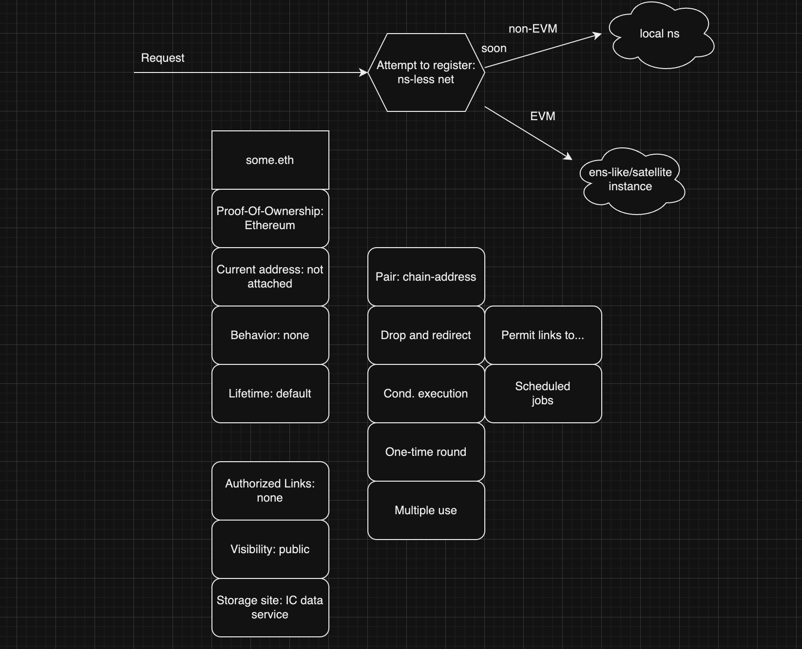

# whatever works 
***built on bitfinity evm, deployed on ICP***

Whatever Works (WW) is a groundbreaking dapp that simplifies the management of decentralized namespaces (DN) across different blockchain networks. It bridges the gap between various blockchains and the ICP blockchain, offering users a unified platform to store, access, and manage their DN, regardless of the blockchain they originate from.

### Reasons to use whatever works

- **Streamlined DN Management:** to stop the to the hassle of handling DNs on multiple blockchains. WW centralizes your DN assets, making it easy to update and access them in one place.
- **Interoperability:** Seamlessly interact with DN from Ethereum and other compatible blockchains, enhancing cross-chain functionality for developers and users.
- **Security:** Your DN are stored securely on the ICP blockchain, utilizing its robust security features and decentralization, ensuring the utmost protection of your valuable digital assets.

### Benefits

- **User-Friendly:** WW offers an intuitive user interface, making it accessible for both crypto enthusiasts and beginners.
- **Efficiency:** Save time and effort by managing DN without the need for complex cross-chain transactions or transfers.
- **Enhanced DeFi:** DeFi applications can easily reference DN across blockchains, providing a more user-friendly experience and reducing errors.
- **Community-Driven:** Join a thriving community of users and developers, shaping the future of DN management and cross-chain compatibility.

### Some of the problems WW is solving 

- **Fragmented ENS Management:**
 :space_invader: ***Problem:*** Users often hold DNs on multiple blockchains, leading to fragmented management and confusion.
 :crystal_ball: ***Solution:*** WW consolidates DN management, providing a single platform to store and manage names from various blockchains.
- **Complex Cross-Chain Transactions:**
 :space_invader: ***Problem:*** Transferring DN between blockchains can be technically challenging and time-consuming.
 :crystal_ball: ***Solution:*** WW eliminates the need for complex cross-chain transactions by enabling users to reference DN directly on the ICP blockchain, simplifying the process.
- **Security Concerns:**
 :space_invader: ***Problem:*** Storing DN on multiple blockchains can expose them to different security risks and vulnerabilities.
 :crystal_ball: ***Solution:*** WW leverages the security features of the ICP blockchain to ensure the safe storage and protection of DNs.
- **Lack of Interoperability:**
 :space_invader: ***Problem:*** Different blockchains often operate in isolation, hindering interoperability and cross-chain functionality.
 :crystal_ball: ***Solution:*** WW enhances interoperability by bridging DN from Ethereum and other compatible blockchains, fostering a more interconnected blockchain ecosystem.
- **Inefficiency in DeFi Applications:**
 :space_invader: ***Problem:*** DeFi applications may struggle to access DN across blockchains, resulting in suboptimal user experiences.
 :crystal_ball: ***Solution:*** WW enables DeFi apps to easily reference DNs, improving user interaction and reducing errors within decentralized financial platforms.
- **User Confusion:**
 :space_invader: ***Problem:*** Users may find it challenging to keep track of their DN assets and their respective blockchains.
 :crystal_ball: ***Solution:*** WW simplifies DN asset management, enhancing user clarity and reducing the risk of losing valuable digital assets.
- **Lack of Centralized Solutions:**
 :space_invader: ***Problem:*** Existing solutions may require users to trust centralized intermediaries to manage their DNs.
 :crystal_ball: ***Solution:*** WW provides a decentralized solution built on the ICP blockchain, eliminating the need for intermediaries and putting users in control of their DNs assets.

***By addressing these problems, WW aims to provide a user-friendly, efficient, and secure solution for managing DNs across multiple blockchains, ultimately enhancing the user experience and expanding the possibilities of cross-chain interactions in the blockchain space.***

### High-level Queue/Executor overview

### Current state
- **core smart contracts deployed on bitfinity evm, front-end available on ICP** 
- **wallet integration: metamask**
- **DNs interaction: EVMs/arbitrium**
- **architecture available**

  for a given DN, WW is able to check proof of ownership of the same (ETH only, soon to be expanded), current address (no yet attached to DN picked as 'main DN',soon to come).

### Bitfinity deployment 
Queue: 0xdca3d9f872decd6177b2e266413bb0acdd29725d4951a1790a74f00921e1fd72
  Executor: 0xa199dd99c0c9449bd9d448aa8b3af81ac9bbf8db93f912375580721d6f8cf4cf 

### Arbitrium deployment 
Queue: 0x7a57D5d5abe4b528945Ef9df809c3d2b0347C9be
  Executor: 0x02f39e83656c3d7ae3f02721c6aa90e01d861c09
  https://testnet.arbiscan.io/address/0x7a57d5d5abe4b528945ef9df809c3d2b0347c9be 

### Future developments
- **wallet-agnostic approach** 
- **interoperability with non-EVM-based DNs**
- **custom behavior modules**
- **asset compatibility adapters**
- ***your idea!***

  for a given DN, WW will able to check proof of ownership for EVM & not EVM DNs, current address & attached ones (WW will allow you to bond DNs to a selected, 'main' one). 
  will allow you to set behaviour & lifetime for you to set conditional executions. (drop & redirect, one-time round, multiple use).

### Future Improvements 

